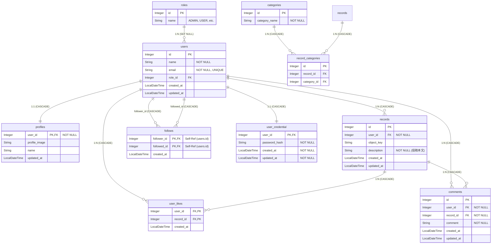

```mermaid
erDiagram
    users ||--|| profiles : "1:1 (CASCADE)"
    users ||--o{ records : "1:N (CASCADE)"
    users ||--o{ follows : "follower_id (CASCADE)"
    users ||--o{ follows : "followed_id (CASCADE)"
    users ||--o{ user_likes : "1:N (CASCADE)"
    users ||--o{ comments : "1:N (CASCADE)"
    records ||--o{ user_likes : "1:N (CASCADE)"
    records ||--o{ comments : "1:N (CASCADE)"
    roles ||--o{ users : "1:N (SET NULL)"
    categories ||--o{ record_categories : "1:N (CASCADE)"
    records　||--o{ record_categories :"1:N (CASCADE)"
    users ||--|| user_credential : "1:1 (CASCADE)"
    
    users {
        Integer id PK
        String name "NOT NULL"
        String email "NOT NULL, UNIQUE"
        Integer role_id FK
        LocalDateTime created_at
        LocalDateTime updated_at
    }
    
    user_credential {
        Integer user_id PK,FK        
        String password_hash "NOT NULL"
        LocalDateTime created_at "NOT NULL"
        LocalDateTime updated_at "NOT NULL"
    }

    profiles {
        Integer user_id PK,FK "NOT NULL"
        String profile_image
        String name
        LocalDateTime updated_at
    }

    follows {
        Integer follower_id PK,FK "Self-Ref (users.id)"
        Integer followed_id PK,FK "Self-Ref (users.id)"
        LocalDateTime created_at
    }

    records {
        Integer id PK
        Integer user_id FK "NOT NULL"
        String object_key
        String description "NOT NULL (投稿本文)"
        LocalDateTime created_at
        LocalDateTime updated_at
    }

    comments {
        Integer id PK
        Integer user_id FK "NOT NULL"
        Integer record_id FK "NOT NULL"
        String comment "NOT NULL"
        LocalDateTime created_at
        LocalDateTime updated_at
    }

    user_likes {
        Integer user_id FK,PK
        Integer record_id FK,PK
        LocalDateTime created_at
    }

    roles {
        Integer id PK
        String name "ADMIN, USER, etc."
    }
 
    record_categories {
        Integer id PK
        Integer record_id FK
        Integer category_id FK
    }
 
    categories {
        Integer id PK
        String category_name "NOT NULL"
    }
```