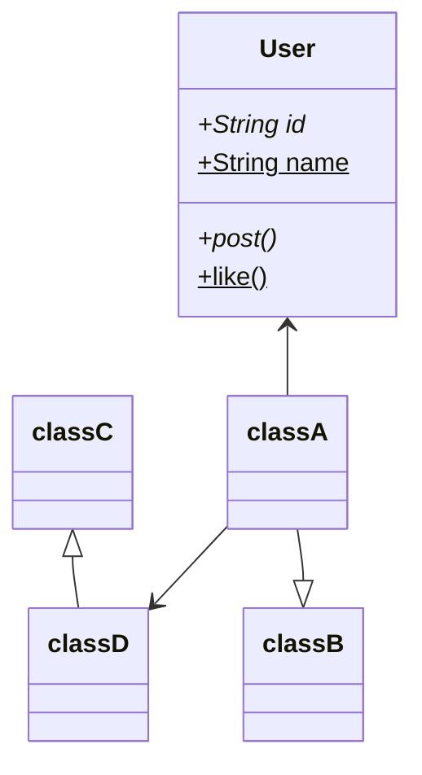

```mermaid  
classDiagram
    User <-- classA
    User: +String id*
    User: +String name$
    User: +post()*
    User: +like()$    
    
    classA --> classD
    classA --|> classB
classC <|-- classD
```
