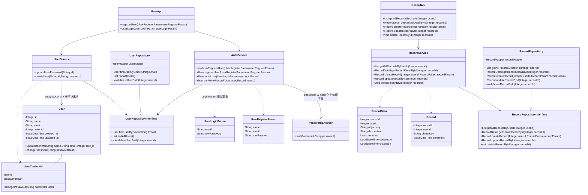

```mermaid  
classDiagram
    User 
    User: -Integer id
    User: -String name
    User: -String email
    User: -Integer role_id
    User: -LocalDateTime created_at
    User: -LocalDateTime updated_at
    User: +updateUserInfo(String name,String email,Integer role_id)
    User: +changePassword(String passwordHash)

    UserRegisterParam
    UserRegisterParam: String name
    UserRegisterParam: String email
    UserRegisterParam: String rowPassword

    UserLoginParam
    UserLoginParam: String email
    UserLoginParam: String rowPassword

    UserService
    UserService: +updateUserPassword(String id)
    UserService: +deleteUser(String id,String password)
    
    UserApi
    UserApi: +registerUser(UserRegisterParam userRegisterParam)
    UserApi: +userLogin(UserLoginParam userLoginParam)
    
    UserCredential
    UserCredential: -userId
    UserCredential: -passwordHash
    UserCredential: +changePassword(String passwordHash)
    
    UserRepositoryInterface
    UserRepositoryInterface: +User findUserByEmail(String Email)
    UserRepositoryInterface: +List<User> findAllUsers()
    UserRepositoryInterface: +void deleteUserById(Integer userId)
    
    UserRepository
    UserRepository: -UserMapper userMapper
    UserRepository: +User findUserByEmail(String Email)
    UserRepository: +List<User> findAllUsers()
    UserRepository: +void deleteUserById(Integer userId)


    AuthService
    AuthService: -bool canRegisterUser(UserRegisterParam userRegisterParam)
    AuthService: +User registerUser(UserRegisterParam userRegisterParam)
    AuthService: +User loginUser(UserLoginParam userLoginParam)
    AuthService: +bool canWriteRecord(User user,Record record)

    PasswordEncoder
    PasswordEncoder: -hashPassword(String password)

    AuthService --> PasswordEncoder : password の hash 化を依頼する
    AuthService ..> UserRegisterParam
    AuthService ..> UserLoginParam : LoginParam 受け取る
    AuthService --> UserRepositoryInterface
    User -- UserCredential
    UserApi --> AuthService
    UserApi --> UserService
    UserRepository --|> UserRepositoryInterface
    UserService --> UserRepositoryInterface
    UserService ..> User : entityのメソッドを呼び出す
    UserService ..> UserCredential

    RecordApi
    RecordApi: +List<Record> getAllRecordsByUserId(Integer userId)
    RecordApi: +RecordDetail getRecordDetailById(Integer recordId)
    RecordApi: +Record createRecord(RecordParam recordParam)
    RecordApi: +Record updateRecordById(Integer recordId)
    RecordApi: +void deleteRecordById(Integer recordId)
    
    RecordService
    RecordService: +List<Record> getAllRecordsByUserId(Integer userId)
    RecordService: +RecordDetail getRecordDetailById(Integer recordId)
    RecordService: +Record createRecord(Integer userId,RecordParam recordParam)
    RecordService: +Record updateRecordById(Integer recordId)
    RecordService: +void deleteRecordById(Integer recordId)
    
    RecordRepositoryInterface
    RecordRepositoryInterface: +List<Record> getAllRecordsByUserId(Integer userId)
    RecordRepositoryInterface: +RecordDetail getRecordDetailById(Integer recordId)
    RecordRepositoryInterface: +Record createRecord(Integer userId,RecordParam recordParam)
    RecordRepositoryInterface: +Record updateRecordById(Integer recordId)
    RecordRepositoryInterface: +void deleteRecordById(Integer recordId)
    
    RecordRepository
    RecordRepository: -RecordMapper recordMapper
    RecordRepository: +List<Record> getAllRecordsByUserId(Integer userId)
    RecordRepository: +RecordDetail getRecordDetailById(Integer recordId)
    RecordRepository: +Record createRecord(Integer userId,RecordParam recordParam)
    RecordRepository: +Record updateRecordById(Integer recordId)
    RecordRepository: +void deleteRecordById(Integer recordId)
    
    
    Record
    Record: -Integer recordId
    Record: -Integer userId
    Record: -String objectKey
    Record: -LocalDateTime createdAt
    
    RecordDetail
    RecordDetail: -Integer recordId
    RecordDetail: -Integer userId
    RecordDetail: -String objectKey
    RecordDetail: -String description 
    RecordDetail: -List<Comment> comments
    RecordDetail: -LocalDateTime updatedAt
    RecordDetail: -LocalDateTime createdAt
    
    RecordApi --> RecordService
    RecordRepository ..|> RecordRepositoryInterface
    RecordService --> RecordRepositoryInterface
    RecordService ..> Record
    RecordService ..> RecordDetail
```
